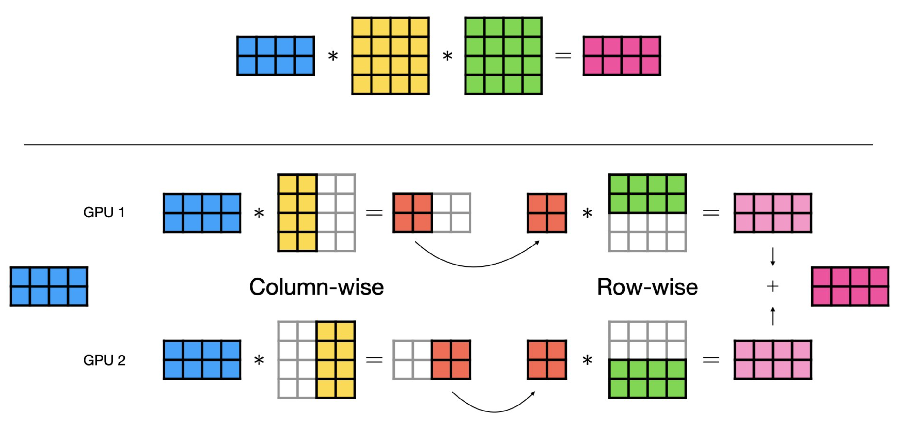
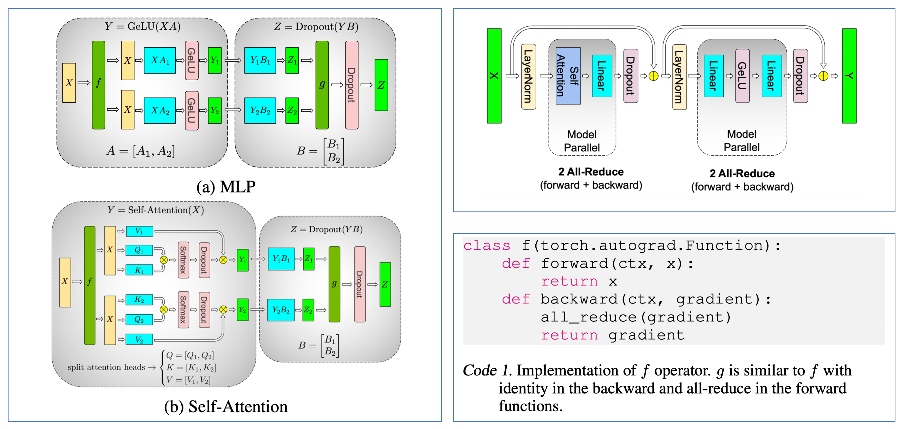
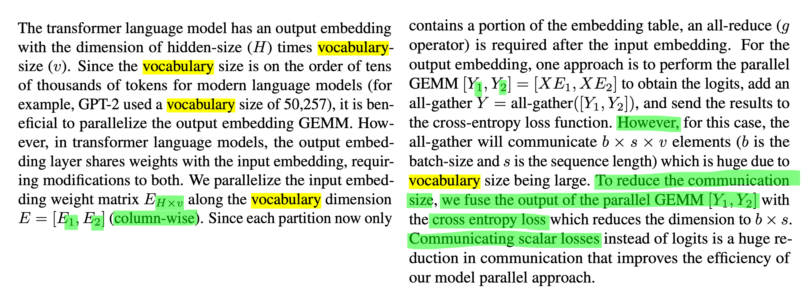
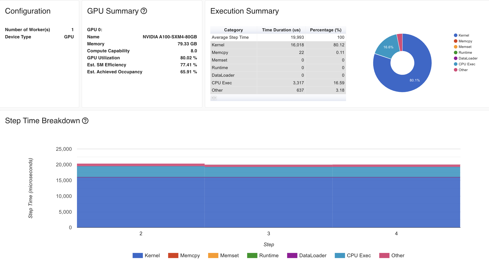
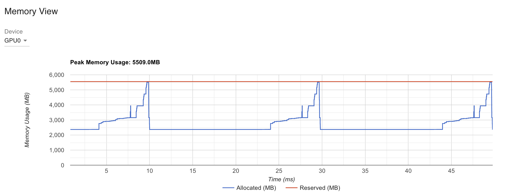
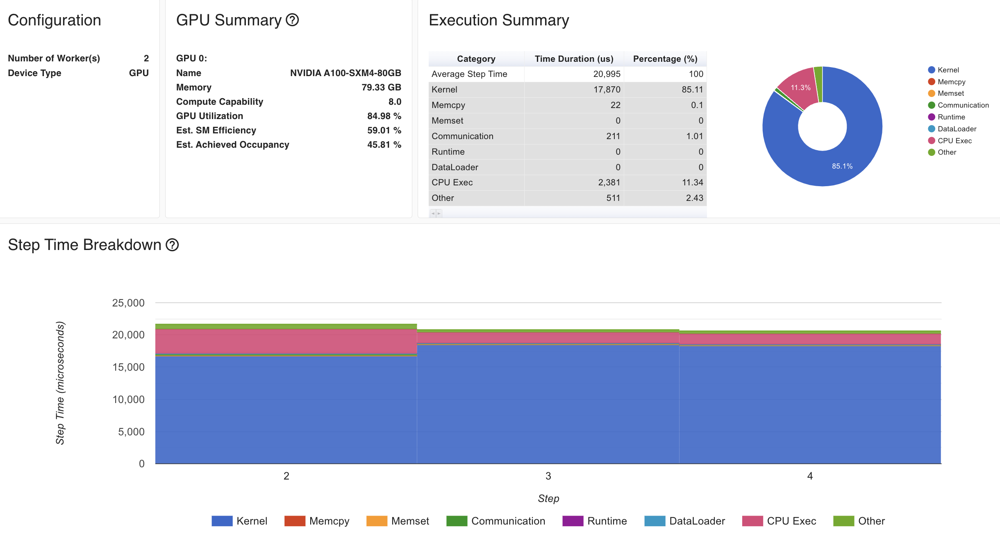
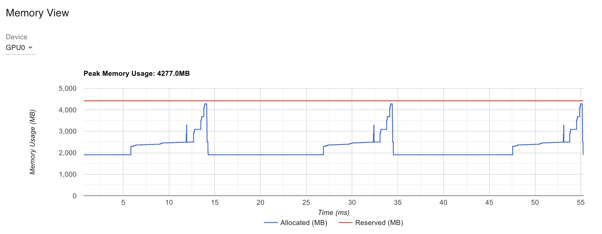
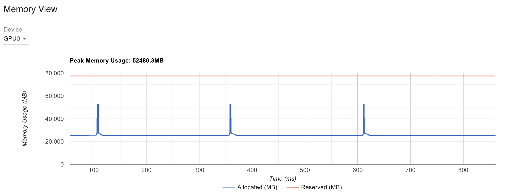
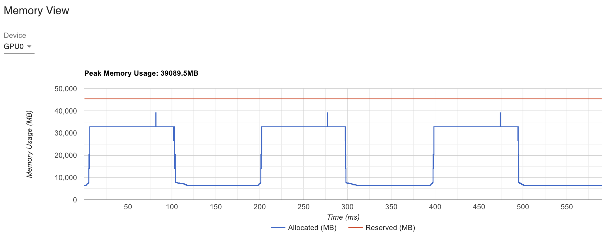

# References

- Papers
  - [Megatron-LM: Training Multi-Billion Parameter Language Models Using Model Parallelism](https://arxiv.org/abs/1909.08053)
  - [Reducing Activation Recomputation in Large Transformer Models](https://arxiv.org/abs/2205.05198)
- Others
  - [pytorch.org/tutorials/intermediate/TP_tutorial.html](https://pytorch.org/tutorials/intermediate/TP_tutorial.html)
  - [lightning.ai/docs/pytorch/stable/advanced/model_parallel/tp.html](https://lightning.ai/docs/pytorch/stable/advanced/model_parallel/tp.html)
  - [pytorch/torchtitan/blob/main/torchtitan/parallelisms/parallelize_llama.py](https://github.com/pytorch/torchtitan/blob/main/torchtitan/parallelisms/parallelize_llama.py)


# Goal

- [x] naive impl on MLP
- [x] transformer (using Autograd)
- [x] vocab parallel (loss parallel)
- [ ] sequence parallel (TBC)

# Examples (run scripts)

## naive impl on MLP




- w/o TP

```bash
export MASTER_ADDR=node0 &&\
export MASTER_PORT=23458 &&\
torchrun --nproc_per_node=1 --master_addr=$MASTER_ADDR --master_port=$MASTER_PORT \
0_naive_tensor_parallel.py
```

```python
rank: 0, world size: 1
model: DummyModel(
  (fc1): Linear(in_features=128, out_features=128, bias=False)
  (fc2): Linear(in_features=128, out_features=128, bias=False)
)

        iter: 1
        output: tensor([[-0.0446,  0.0869,  0.2034,  ...,  0.0353, -0.2906,  0.0388],
        [-0.0149,  0.3999,  0.0187,  ...,  0.1280, -0.1074,  0.2212],
        [ 0.0592,  0.2287,  0.2629,  ..., -0.3098,  0.3747,  0.1021],
        ...,
        [-0.1120,  0.1608,  0.1155,  ...,  0.0570, -0.0458,  0.3998],
        [-0.0837,  0.1127,  0.1840,  ..., -0.0339,  0.3072,  0.6933],
        [ 0.1525,  0.2822, -0.0211,  ...,  0.1974,  0.0768,  0.2375]],
       device='cuda:0', grad_fn=<MmBackward0>)
        loss: 0.969451904296875
        fc1_grad = tensor([[-0.7231,  0.7115, -0.2774,  ..., -0.6077, -0.0960,  0.1508],
        [-0.0553, -0.4548, -0.0235,  ...,  0.1630, -0.1945, -0.1485],
        [ 1.4298, -1.3797,  1.5428,  ...,  2.0844, -0.6803,  0.3992],
        ...,
        [-1.3434,  1.1863, -0.8411,  ..., -0.6940,  0.9600,  0.8013],
        [-0.1506,  0.7074, -0.3786,  ..., -1.2123,  1.7474,  1.8508],
        [-0.5859,  0.4911, -0.4167,  ..., -0.0043,  0.1661,  0.3382]],
       device='cuda:0')
        

        iter: 2
        output: tensor([[-0.5817, -0.0260, -0.5679,  ..., -0.5887, -0.6975, -0.1548],
        [-0.2621,  0.1407, -0.4802,  ..., -0.1570, -0.2467,  0.1012],
        [-0.2493,  0.1170, -0.3523,  ..., -0.7328,  0.1866, -0.3034],
        ...,
        [-0.3621, -0.0533, -0.3692,  ..., -0.4276, -0.2218,  0.1831],
        [-0.4475,  0.1047, -0.7256,  ..., -0.5500, -0.0167,  0.1446],
        [-0.1938, -0.2023, -0.7151,  ..., -0.1744, -0.3086, -0.0498]],
       device='cuda:0', grad_fn=<MmBackward0>)
        loss: -445.4638671875
        fc1_grad = tensor([[ 2.4085,  1.6419,  0.8216,  ...,  2.0955,  0.7012, -1.0162],
        [-0.7059, -5.8104, -0.3002,  ...,  2.0821, -2.4854, -1.8969],
        [ 4.1235, -3.9789,  4.4493,  ...,  6.0115, -1.9621,  1.1513],
        ...,
        [ 0.2301, -1.8097, -0.5846,  ...,  1.1556, -0.6764, -0.2249],
        [ 0.0000,  0.0000,  0.0000,  ...,  0.0000,  0.0000,  0.0000],
        [ 1.4045, -0.0199,  0.4096,  ...,  0.3518, -0.3399, -1.3144]],
       device='cuda:0')
```

- w/ TP

```bash
export LOCAL_RANK=1 &&\
export WORLD_SIZE=2 &&\
export MASTER_ADDR=node0 &&\
export MASTER_PORT=23458 &&\
torchrun --nproc_per_node=$WORLD_SIZE --master_addr=$MASTER_ADDR --master_port=$MASTER_PORT \
0_naive_tensor_parallel.py --TP
```

```python
rank: 0, world size: 2
rank: 1, world size: 2
model: DummyModel(
  (fc1): Linear(in_features=128, out_features=128, bias=False)
  (fc2): Linear(in_features=128, out_features=128, bias=False)
)

        iter: 1
        output: tensor([[-0.0446,  0.0869,  0.2034,  ...,  0.0353, -0.2906,  0.0388],
        [-0.0149,  0.3999,  0.0187,  ...,  0.1280, -0.1074,  0.2212],
        [ 0.0592,  0.2287,  0.2629,  ..., -0.3098,  0.3747,  0.1021],
        ...,
        [-0.1120,  0.1608,  0.1155,  ...,  0.0570, -0.0458,  0.3998],
        [-0.0837,  0.1127,  0.1840,  ..., -0.0339,  0.3072,  0.6933],
        [ 0.1525,  0.2822, -0.0211,  ...,  0.1974,  0.0768,  0.2375]],
       device='cuda:0', grad_fn=<MmBackward0>)
        loss: 0.9694492816925049
        fc1_grad = tensor([[-0.7231,  0.7115, -0.2774,  ..., -0.6077, -0.0960,  0.1508],
        [-0.0553, -0.4548, -0.0235,  ...,  0.1630, -0.1945, -0.1485],
        [ 1.4298, -1.3797,  1.5428,  ...,  2.0844, -0.6803,  0.3992],
        ...,
        [-1.3434,  1.1863, -0.8411,  ..., -0.6940,  0.9600,  0.8013],
        [-0.1506,  0.7074, -0.3786,  ..., -1.2123,  1.7474,  1.8508],
        [-0.5859,  0.4911, -0.4167,  ..., -0.0043,  0.1661,  0.3382]],
       device='cuda:0')
        

        iter: 2
        output: tensor([[-0.5817, -0.0260, -0.5679,  ..., -0.5887, -0.6975, -0.1548],
        [-0.2621,  0.1407, -0.4802,  ..., -0.1570, -0.2467,  0.1012],
        [-0.2493,  0.1170, -0.3523,  ..., -0.7328,  0.1866, -0.3034],
        ...,
        [-0.3621, -0.0533, -0.3692,  ..., -0.4276, -0.2218,  0.1831],
        [-0.4475,  0.1047, -0.7256,  ..., -0.5500, -0.0167,  0.1446],
        [-0.1938, -0.2023, -0.7151,  ..., -0.1744, -0.3086, -0.0498]],
       device='cuda:0', grad_fn=<MmBackward0>)
        loss: -445.4638671875
        fc1_grad = tensor([[ 2.4085,  1.6419,  0.8216,  ...,  2.0955,  0.7012, -1.0162],
        [-0.7059, -5.8104, -0.3002,  ...,  2.0821, -2.4854, -1.8969],
        [ 4.1235, -3.9789,  4.4493,  ...,  6.0115, -1.9621,  1.1513],
        ...,
        [ 0.2301, -1.8097, -0.5846,  ...,  1.1556, -0.6764, -0.2249],
        [ 0.0000,  0.0000,  0.0000,  ...,  0.0000,  0.0000,  0.0000],
        [ 1.4045, -0.0199,  0.4096,  ...,  0.3518, -0.3399, -1.3144]],
       device='cuda:0')
```


## Transformer with TP





- w/o TP

```bash
export MASTER_ADDR=node0 &&\
export MASTER_PORT=23458 &&\
torchrun --nproc_per_node=1 --master_addr=$MASTER_ADDR --master_port=$MASTER_PORT \
1_transformer_tensor_parallel.py
```

```python
rank: 0, world size: 1

        iter: 1
        loss: 10.939807891845703
        

        iter: 2
        loss: 3.437135934829712
        

        iter: 3
        loss: 1.5810130834579468
        

        iter: 4
        loss: 0.453738808631897
        

        iter: 5
        loss: 0.1264963299036026
```

- w/ TP

```bash
export LOCAL_RANK=1 &&\
export WORLD_SIZE=2 &&\
export MASTER_ADDR=node0 &&\
export MASTER_PORT=23458 &&\
torchrun --nproc_per_node=$WORLD_SIZE --master_addr=$MASTER_ADDR --master_port=$MASTER_PORT \
1_transformer_tensor_parallel.py --TP
```


```python
rank: 1, world size: 2
rank: 0, world size: 2

        iter: 1
        loss: 10.939807891845703
        

        iter: 2
        loss: 3.4371347427368164
        

        iter: 3
        loss: 1.58101224899292
        

        iter: 4
        loss: 0.45373836159706116
        

        iter: 5
        loss: 0.12649638950824738
```


### Memroy Profiling

```
--use_torch_profiler
```

```bash
export MASTER_ADDR=node0 &&\
export MASTER_PORT=23458 &&\
torchrun --nproc_per_node=1 --master_addr=$MASTER_ADDR --master_port=$MASTER_PORT \
1_transformer_tensor_parallel.py --use_torch_profiler --hidden=2048
```

```bash
export LOCAL_RANK=1 &&\
export WORLD_SIZE=2 &&\
export MASTER_ADDR=node0 &&\
export MASTER_PORT=23458 &&\
torchrun --nproc_per_node=$WORLD_SIZE --master_addr=$MASTER_ADDR --master_port=$MASTER_PORT \
1_transformer_tensor_parallel.py --TP --use_torch_profiler --hidden=2048
```











### Applying Vocab (Loss) Parallel

```bash
export MASTER_ADDR=node0 &&\
export MASTER_PORT=23458 &&\
torchrun --nproc_per_node=1 --master_addr=$MASTER_ADDR --master_port=$MASTER_PORT \
1_transformer_tensor_parallel.py --batch_size 2 --seq_len 64
```

```python
        iter: 1
        input size: torch.Size([2, 64])
        num padding toekns: 12
        loss: 11.14531421661377
        

        iter: 2
        input size: torch.Size([2, 64])
        num padding toekns: 12
        loss: 7.8605475425720215
        

        iter: 3
        input size: torch.Size([2, 64])
        num padding toekns: 12
        loss: 6.055154800415039
        

        iter: 4
        input size: torch.Size([2, 64])
        num padding toekns: 12
        loss: 4.597280502319336
        

        iter: 5
        input size: torch.Size([2, 64])
        num padding toekns: 12
        loss: 3.266993761062622
```


```bash
export MASTER_ADDR=node0 &&\
export MASTER_PORT=23458 &&\
torchrun --nproc_per_node=1 --master_addr=$MASTER_ADDR --master_port=$MASTER_PORT \
1_transformer_tensor_parallel.py --batch_size 2 --seq_len 64 --loss_parallel
```

```python
        iter: 1
        input size: torch.Size([2, 64])
        num padding toekns: 12
        loss: 11.145313262939453
        

        iter: 2
        input size: torch.Size([2, 64])
        num padding toekns: 12
        loss: 7.860340595245361
        

        iter: 3
        input size: torch.Size([2, 64])
        num padding toekns: 12
        loss: 6.054848670959473
        

        iter: 4
        input size: torch.Size([2, 64])
        num padding toekns: 12
        loss: 4.597006320953369
        

        iter: 5
        input size: torch.Size([2, 64])
        num padding toekns: 12
        loss: 3.2667441368103027
```

```bash
export LOCAL_RANK=1 &&\
export WORLD_SIZE=2 &&\
export MASTER_ADDR=node0 &&\
export MASTER_PORT=23458 &&\
torchrun --nproc_per_node=$WORLD_SIZE --master_addr=$MASTER_ADDR --master_port=$MASTER_PORT \
1_transformer_tensor_parallel.py --batch_size 2 --seq_len 64 --loss_parallel --TP
```


```python
        iter: 1
        input size: torch.Size([2, 64])
        num padding toekns: 12
        loss: 11.145294189453125
        

        iter: 2
        input size: torch.Size([2, 64])
        num padding toekns: 12
        loss: 7.860313415527344
        

        iter: 3
        input size: torch.Size([2, 64])
        num padding toekns: 12
        loss: 6.0548553466796875
        

        iter: 4
        input size: torch.Size([2, 64])
        num padding toekns: 12
        loss: 4.596996307373047
        

        iter: 5
        input size: torch.Size([2, 64])
        num padding toekns: 12
        loss: 3.2667508125305176
```


### Profling Final Results

- batch_size: 256
- sqe_len: 256
- 1gpu baseline vs 2gpu TP

```bash
export LOCAL_RANK=1 &&\
export WORLD_SIZE=2 &&\
export MASTER_ADDR=node0 &&\
export MASTER_PORT=23458 &&\
torchrun --nproc_per_node=$WORLD_SIZE --master_addr=$MASTER_ADDR --master_port=$MASTER_PORT \
1_transformer_tensor_parallel.py --batch_size 256 --seq_len 256 --use_torch_profiler
```



```bash
export LOCAL_RANK=1 &&\
export WORLD_SIZE=2 &&\
export MASTER_ADDR=node0 &&\
export MASTER_PORT=23458 &&\
torchrun --nproc_per_node=$WORLD_SIZE --master_addr=$MASTER_ADDR --master_port=$MASTER_PORT \
1_transformer_tensor_parallel.py --batch_size 256 --seq_len 256 --loss_parallel --TP --use_torch_profiler
```


